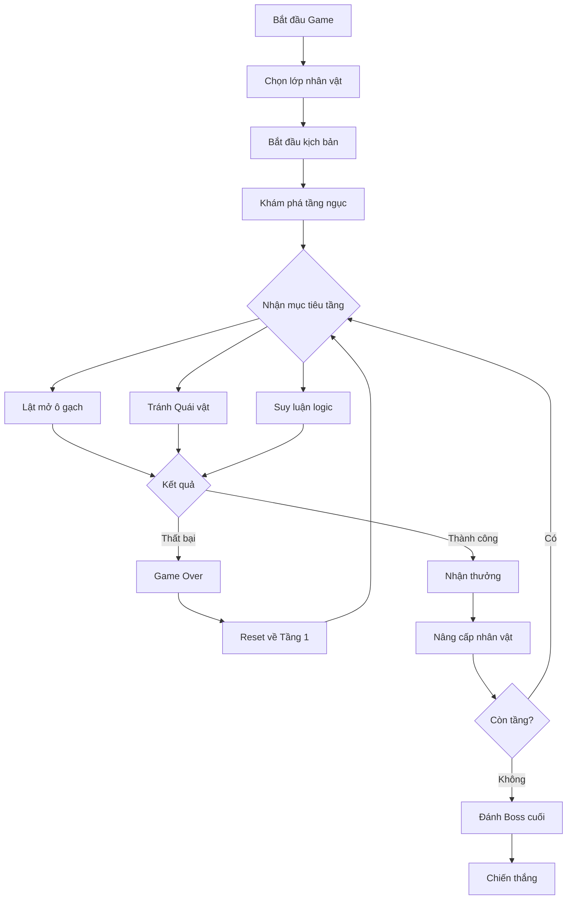

# TÀI LIỆU THIẾT KẾ TRÒ CHƠI (GDD) - DUNGEON SEEKER

## MỤC LỤC
1. [PHẦN 1 – GAME DESIGN DOCUMENT](#phần-1--game-design-document)
   1.1. [Giới thiệu chung](#giới-thiệu-chung)
   1.2. [Tổng quan về game](#tổng-quan-về-game)
   1.3. [Cách chơi, mục tiêu và sự tiến triển trong game](#cách-chơi-mục-tiêu-và-sự-tiến-triển-trong-game)
   1.4. [Quy tắc và cơ chế vận hành của game](#quy-tắc-và-cơ-chế-vận-hành-của-game)
   1.5. [Hệ thống đồ họa và âm thanh](#hệ-thống-đồ-họa-và-âm-thanh)
   1.6. [Cốt truyện và nhân vật](#cốt-truyện-và-nhân-vật)
   1.7. [Chi tiết về thế giới game và cấp độ](#chi-tiết-về-thế-giới-game-và-cấp-độ)
   1.8. [Tối ưu hóa gameplay, Kế hoạch phát triển và Phát hành](#tối-ưu-hóa-gameplay-kế-hoạch-phát-triển-và-phát-hành)
2. [PHẦN 2 – TÀI LIỆU KỸ THUẬT](#phần-2--tài-liệu-kỹ-thuật)
   2.1. [Phân tích ý tưởng game (SWOT Analysis)](#phân-tích-ý-tưởng-game-swot-analysis)
   2.2. [Thiết kế Game (Sơ đồ Game Loop)](#thiết-kế-game-sơ-đồ-game-loop)
   2.3. [Công nghệ & hệ thống](#công-nghệ--hệ-thống)

---

## LỜI CẢM ƠN
Dự án game **DUNGEON SEEKER** là thành quả của sự nỗ lực, cố gắng và kiên trì không ngừng nghỉ của em trong suốt thời gian qua. Tuy nhiên, dự án này sẽ khó có thể hoàn thiện nếu thiếu đi sự hướng dẫn, chỉ bảo và hỗ trợ nhiệt tình từ giảng viên - **Thầy Nguyễn Ngọc Chấn**, trường Cao đẳng FPT Polytechnic. 

Em xin được gửi lời cảm ơn chân thành và sâu sắc nhất đến Thầy Nguyễn Ngọc Chấn. Nhờ những chia sẻ, kinh nghiệm quý báu và sự sát sao của thầy từ những ngày đầu tiên khi em vừa lên ý tưởng triển khai. Dù quá trình thực hiện gặp nhiều khó khăn, thầy luôn là người định hướng, sẵn sàng giải đáp các vướng mắc và đưa ra các hướng xử lý kịp thời, giúp em vững bước và hoàn thành trọn vẹn trò chơi DUNGEON SEEKER. 

Cuối cùng, em xin gửi lời tri ân đến Ban lãnh đạo trường Cao đẳng FPT Polytechnic cùng toàn thể Quý thầy cô ngành Lập trình Game. Cảm ơn nhà trường và các thầy cô đã luôn dìu dắt, truyền đạt kiến thức và tạo mọi điều kiện thuận lợi nhất để em được học tập, phát triển và hoàn thành tốt đồ án tốt nghiệp này. 

Em xin chân thành cảm ơn!

*Thành phố Hồ Chí Minh, ngàyㅤthángㅤnăm 2026*
**Sinh viên thực hiện: Lê Bá Khôi**

---

## LỜI MỞ ĐẦU
Hiện nay, ngành công nghiệp game đang phát triển mạnh mẽ và trở thành một trong những lĩnh vực giải trí có sức ảnh hưởng sâu rộng trên toàn cầu. Với sự tiến bộ nhanh chóng của công nghệ và các công cụ hỗ trợ, việc phát triển một trò chơi điện tử không còn là điều xa vời đối với sinh viên hay những người đam mê sáng tạo nội dung số. 

Trong bối cảnh đó, nhu cầu trải nghiệm các tựa game đòi hỏi tư duy logic kết hợp với yếu tố sinh tồn ngẫu nhiên (roguelike) đang ngày càng được cộng đồng người chơi đón nhận nồng nhiệt vì tính thử thách và giá trị chơi lại cao. Xuất phát từ niềm đam mê với thể loại giải đố (puzzle) và mong muốn mang đến một góc nhìn hoàn toàn mới cho lối chơi "Dò mìn" (Minesweeper) kinh điển, em đã quyết định phát triển dự án **"DUNGEON SEEKER"** – một tựa game giải đố thám hiểm hầm ngục được thiết kế với đồ họa 2D góc nhìn Isometric. 

Dự án được phát triển bằng nền tảng Unity, nhằm giúp em tiếp cận sâu hơn với quy trình thiết kế và lập trình game 2D Isometric. Đây cũng là cơ hội quý báu để em áp dụng các bài học vào thực tế, đồng thời nghiên cứu sâu hơn về các kỹ thuật nâng cao như: thuật toán tạo hình bản đồ ngẫu nhiên (Procedural Generation), logic lưới (Grid System), và tư duy quản lý tài nguyên hệ thống phức tạp trong game.

---

## GIỚI THIỆU DỰ ÁN
Trong thời đại mà công nghệ giải trí ngày càng phát triển, nhu cầu tìm kiếm những trò chơi mang tính giải đố kích thích tư duy, kết hợp với yếu tố sinh tồn ngẫu nhiên (roguelike) đang trở nên phổ biến đối với cộng đồng game thủ. **DUNGEON SEEKER** được xây dựng với mục tiêu mang đến một làn gió mới cho dòng game kinh điển dò mìn (Minesweeper) bằng cách lồng ghép khéo léo các yếu tố sinh tồn (Roguelike) và thám hiểm hầm ngục (Dungeon Crawler) trên đồ họa 2D góc nhìn Isometric. 

**Thành viên dự án:**
*   **Lê Bá Khôi**
    *   Phân tích và Thiết kế Game
    *   Thiết kế Giao diện (UI/UX)
    *   Lập trình Gameplay
    *   Gmail: khoilbts00564@fpt.edu.vn
    *   MSSV: TS00564

---

## PHẦN 1 – GAME DESIGN DOCUMENT

### 1.1. Giới thiệu chung
#### 1.1.1. Giới thiệu
Tài liệu Thiết kế Trò chơi (GDD) này cung cấp cái nhìn tổng quan và chi tiết nhất về dự án DUNGEON SEEKER. Với tư cách là một nhà phát triển độc lập, GDD đóng vai trò là xương sống cốt lõi, hướng dẫn tác giả và hội đồng đánh giá nắm bắt rõ ràng từ ý tưởng đến kỹ thuật.

#### 1.1.2. Xác định phạm vi tài liệu
Tài liệu giám sát quá trình từ ý tưởng, thiết kế, lập trình đến hoàn thiện sản phẩm. Nó cũng là hệ thống quản lý dự án giúp theo dõi tiến độ và điều chỉnh linh hoạt.

#### 1.1.3. Nội dung chính của trò chơi (Elevator Pitch)
Người chơi hóa thân thành một nhà thám hiểm đơn độc chinh phục hầm ngục tăm tối. Sử dụng trí não để phán đoán vị trí quái vật ẩn (Minesweeper logic) trên địa hình lưới Isometric ngẫu nhiên (Roguelike) để tìm lối thoát.

#### 1.1.4. Đối tượng người chơi hướng đến (Target Audience)
Độ tuổi 12-16+, yêu thích tư duy chiến thuật, giải đố logic và dòng game Indie thử thách.

### 1.2. Tổng quan về game
#### 1.2.1. Nội dung và mục tiêu của game (Game concept)
Hậu duệ dòng tộc "Seekers" dấn thân vào "Mê cung mê hoặc" để thanh tẩy ma lực rò rỉ. Mục tiêu là giải mã từng tầng ngục, tìm cầu thang và đánh bại thực thể canh giữ tầng đáy.

#### 1.2.2. Thể loại của game (Genre)
*   **Chính:** Giải đố chiến thuật (Puzzle Strategy)
*   **Phụ:** Roguelike, Dungeon Crawler

#### 1.2.3. Giải đố chiến thuật (Puzzle - Strategy RPG)
Đề cao tư duy logic, quản lý tài nguyên (HP, Mana, Steps) và sử dụng vật phẩm chiến lược.

#### 1.2.4. Roguelike
Giá trị chơi lại vô hạn nhờ bản đồ sinh ngẫu nhiên và áp lực tâm lý từ cơ chế "chết là hết".

#### 1.2.5. Bối cảnh của game
Thế giới Dark Fantasy u tối, kết hợp kiến trúc Trung cổ và ma thuật kỳ ảo trong "Mê cung Vĩnh hằng".

#### 1.2.6. Cấu trúc, cách chơi của game
Góc nhìn Top-down Isometric. Lối chơi tập trung vào Suy luận, Khám phá và Quản lý tài nguyên. Ba lớp nhân vật chính: Hộ vệ, Trinh sát, Học giả.

#### 1.2.7. Nhân vật chính, số lượng người chơi
Nhân vật: The Seeker. Chế độ chơi: Đơn người (Single-player).

### 1.3. Cách chơi, mục tiêu và sự tiến triển trong game
#### 1.3.1. Mục tiêu chính và mục tiêu phụ trong game
*   **Chính:** Chinh phục hầm ngục, đánh bại Boss cuối.
*   **Phụ:** Truy tìm kho báu, tối ưu hóa lượt đi, khám phá cổ vật.

#### 1.3.2. Sự tiến triển trong game
Tiến triển qua chiều sâu tầng ngục, phát triển chỉ số nhân vật và tích lũy kinh nghiệm qua các vòng lặp (Runs).

#### 1.3.3. Sự tiến triển của câu chuyện trong game
Khám phá phi tuyến tính qua 2 tầng chính: Hành lang tăm tối và Sảnh đường linh hồn.

#### 1.3.4. Cân bằng độ khó của game
Sử dụng Dynamic Difficulty, thuật toán đảm bảo tính logic và hệ thống vật phẩm cứu viện.

### 1.4. Quy tắc và cơ chế vận hành của game
Quy tắc về sương mù (Fog), số gợi ý (Numbers), giới hạn lượt đi (Steps), và điều kiện thắng/thua.

### 1.5. Hệ thống đồ họa và âm thanh
Đồ họa 2D Isometric, UI biểu tượng đặc trưng (Tim, Trăng, Đồng hồ). Âm thanh Dark Ambient và SFX phản hồi hành động.

### 1.6. Cốt truyện và nhân vật
Hành trình của Seeker tái lập phong ấn vương quốc Solaryn chống lại các Glitchers và Gatekeepers.

### 1.7. Chi tiết về thế giới game và cấp độ
Cấu trúc tầng ngục (Grid Layout) qua 3 khu vực: Hành lang thạch nhũ, Sảnh đường linh hồn, Đáy vực bí ẩn.

### 1.8. Tối ưu hóa gameplay, Kế hoạch phát triển và Phát hành
Roadmap 8 tuần từ Prototype đến Polish. Phát hành trên Itch.io.

---

## PHẦN 2 – TÀI LIỆU KỸ THUẬT

### 2.1. Phân tích ý tưởng game (SWOT Analysis)
*   **Strengths:** Ý tưởng độc đáo, cơ chế gây nghiện.
*   **Weaknesses:** Solo-dev, áp lực thời gian.
*   **Opportunities:** Thị trường Indie tiềm năng.
*   **Threats:** Độ khó thuật toán logic.

### 2.2. Thiết kế Game (Sơ đồ Game Loop)

#### 2.2.1. Mô tả chi tiết Luồng vận hành
Vòng lặp: Thám hiểm -> Giải mã -> Thu thập -> Nâng cấp.

#### 2.2.2. Hệ thống Chức năng (Core Features)
Hệ thống Grid, Movement, Resource Management, và Inventory.

#### 2.2.3. Sơ đồ lớp (Class Diagram - Sơ lược)
Managers: `MapManager`, `PlayerController`, `UIManager`, `GameController`.

#### 2.2.4. Phân tách trạng thái và Cấu trúc màn chơi
States: Menu, Loading, Playing, Paused, Result.

#### 2.2.5. Đặc trưng Kỹ thuật
PC Windows, Unity 6000.3.10f1, Ngôn ngữ C#.

#### 2.2.6. Chi tiết Tài nguyên Dự án (Project Assets)
Sprites nhân vật, quái vật (Slime, Wraith), rương báu, bối cảnh Isometric hầm ngục.

#### 2.2.7. Chi tiết Thiết kế Gameplay & Âm thanh
Minesweeper logic, BGM u ám, SFX nổ ma thuật.

### 2.3. Công nghệ & hệ thống
*   **Engine:** Unity 6000.3.10f1
*   **Công cụ:** GitHub Desktop, VS Code, Google Antigravity.
*   **Cấu hình tối thiểu:** i5, 8GB RAM, GTX 1050.
